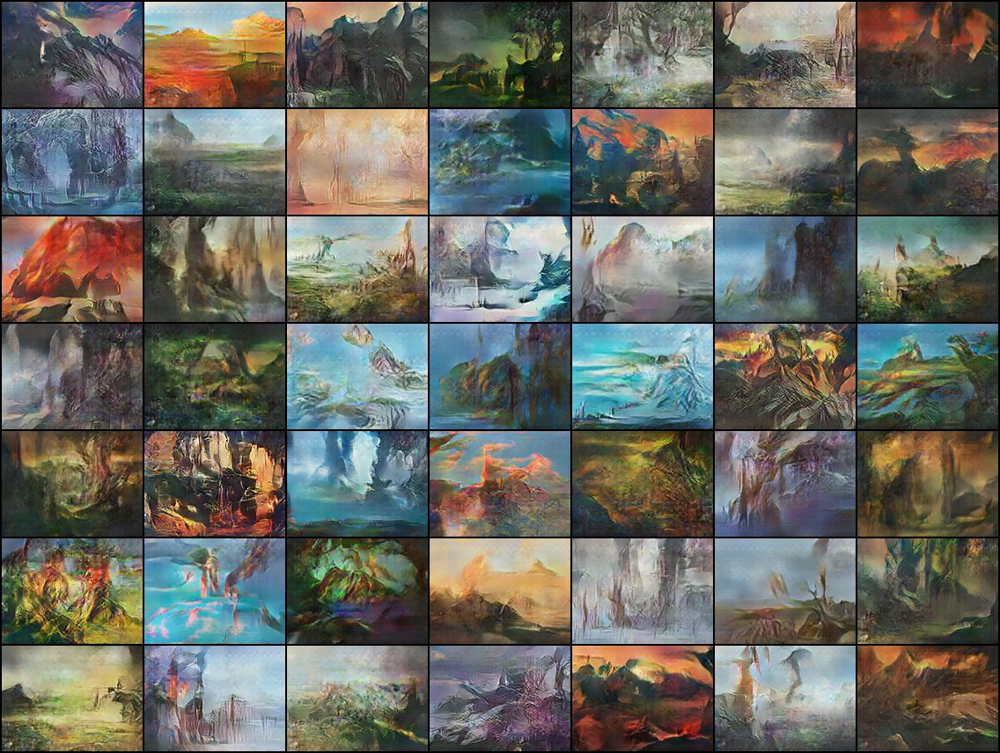

#  GANART: generative adversalial networks to paint Magic: the Gathering art

Dataset not provided for legal reasons. Example in this file are results of GANs trained on MtG lands illustrations.

[Check out this blog post](https://medium.com/ai-society/gans-from-scratch-1-a-deep-introduction-with-code-in-pytorch-and-tensorflow-cb03cdcdba0f) for an introduction to Generative Networks. 

Selected results from unrolled GAN trained on all lands

## Lin-GANART
Simple GAN composed of two perceptrons.

## GANART (wip)
Unrolled DCGAN

Sample result trained on all lands

### Previous versions selected results

Standard DCGAN trained on basic lands only

Standard DCGAN trained on all lands

## GANART-load
Load a pretrained Generator and generates art.
